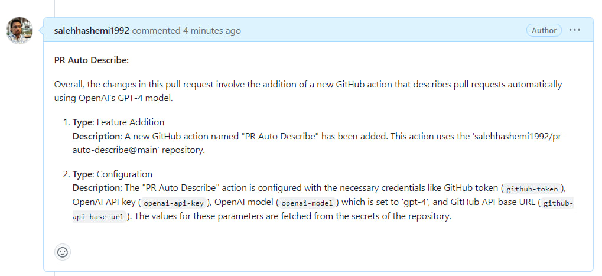

# PR Auto Describe
Automatically generate descriptions for pull requests using AI.

When you open or update a pull request labeled with **"ai-describe"**, this action will automatically generate a concise list of changes for pull requests and post them as comments on the pull request.

The Action categorizes each change by its type (e.g., 'Refactor', 'Bug Fix', 'Optimization') for an easy-to-understand summary.

### Example Output


## Requirements
* GitHub API token for API access.
* OpenAI API key for fetching AI suggestions.

## Usage
To use this action in your GitHub repository, follow these steps:

1. In your GitHub repository, add a secret named `OPENAI_API_KEY` that contains your OpenAI API key.
2. Similarly, add a secret named `TOKEN` with your GitHub API token that grants access to the repository.
3. Add the following workflow file to your repository in the `.github/workflows` directory, and name it `pr-auto-describe.yml`:

```yaml
on:
  pull_request:
    types: [synchronize, reopened, labeled]

jobs:
  describe:
    runs-on: ubuntu-latest
    permissions:
      contents: write
    steps:
      - name: Checkout repository
        uses: actions/checkout@v4
        with:
          fetch-depth: 0

      - name: PR Auto Describe
        uses: salehhashemi1992/pr-auto-describe@main
        with:
          github-token: ${{ secrets.TOKEN }}
          openai-api-key: ${{ secrets.OPENAI_API_KEY }}
          openai-model: 'gpt-4' # Optional, you can use 'gpt-3.5-turbo' or 'gpt-4-32k' as well.
          github-api-base-url: 'https://api.github.com' # Optional, defaults to 'https://api.github.com'
```

## Configuration

The action accepts the following inputs:

| Input          | Required | Description |
|----------------|-|-|
| `github-token`   | Yes | The GitHub API token for accessing the repository. |
| `openai-api-key` | Yes | The API key for accessing the OpenAI API. |
| `openai-model`   | No | Supported values are 'gpt-3.5-turbo', 'gpt-4', and 'gpt-4-32k'. Defaults to 'gpt-3.5-turbo'.|
| `openai-api-base-url`   | No | The base URL for the GitHub API. Defaults to 'https://api.github.com'.|

### Changelog

Please see [CHANGELOG](CHANGELOG.md) for more information what has changed recently.

## Contributing

Please see [CONTRIBUTING](CONTRIBUTING.md) for details.

## Credits

-   [Saleh Hashemi](https://github.com/salehhashemi1992)
-   [All Contributors](../../contributors)

## License

The MIT License (MIT). Please see [License File](LICENSE) for more information.